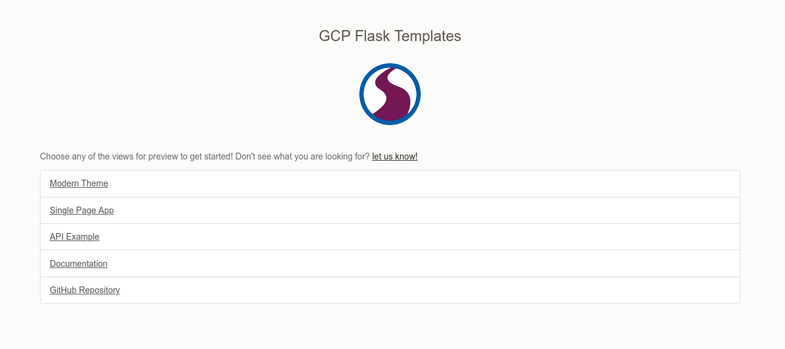

# GCP Flask Starter Template

> Google Cloud Project Flask Starter Template

You might want to quickly deploy an application to show off your analysis, paper,
or even create a programmatic RestFul API for others to use. You should not need
to start from scratch to do this! This free-to-use templates will get you started with a solid base for your development.

This particular teplate will get you started to deploy a Flask application
on [Google App Engine](https://cloud.google.com/appengine/docs/standard/python3/building-app/writing-web-service)! 
The template includes:

 - several branded themes to choose from
 - a basic user and registration model
 - a restful API example
 - several database options, sqlite, postgres and mysql
 - examples of testing for your code

## Getting Started

You can jump in to the [documentation](https://rse-ops.github.io/gcp-flask-template) to
get started. If you have any requests for features or questions, please don't hesitate
to [open an issue](https://github.com/rse-ops/gcp-flask-template/issues).

## Extra Features

The following extra features might be useful to you, and if you would like help to develop
them for your application, please [let us know](https://github.com/rse-ops/gcp-flask-template/issues).

 - **Custom Search** of pages or models (the current search goes to Google search)
 - **Social Authentication** for login with social identities such as Twitter, Google, Globus, etc.
 - **SAML authentication** for more specific institutional access.
 
## Thanks

This theme was originally developed by @vsoch under [stanford-rc](https://github.com/stanford-rc),
and has been migrated here so she can continue to maintain it!

License
-------

Copyright (c) 2021, Lawrence Livermore National Security, LLC. 
Produced at the Lawrence Livermore National Laboratory.

The RADIUSS documentation is licensed under the MIT license [LICENSE](./LICENSE).

Copyrights and patents in the RADIUSS project are retained by
contributors. No copyright assignment is required to contribute to RADIUSS
Docker.

This work was produced under the auspices of the U.S. Department of
Energy by Lawrence Livermore National Laboratory under Contract
DE-AC52-07NA27344.
